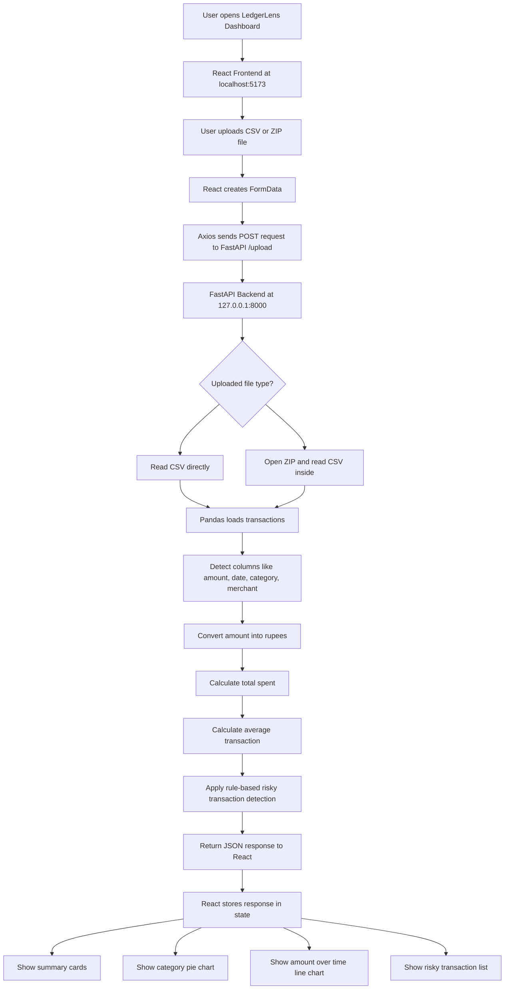

# LedgerLens Project Workflow

LedgerLens is a full-stack financial dashboard. It lets a user upload credit card transaction data as a CSV or ZIP file, analyzes the data in a FastAPI backend, and shows spending insights in a React dashboard.

## One-Line Summary

LedgerLens uploads transaction data, processes it in the backend, and visualizes total spending, average transactions, category-wise spending, spending over time, and risky transactions.

## Tech Stack

- Frontend: React, Vite, Axios, Recharts
- Backend: FastAPI, Pandas
- Data: CSV or ZIP file containing transaction records
- Frontend URL: `http://localhost:5173`
- Backend URL: `http://127.0.0.1:8000`

## Project Structure

```text
ledgerlens
  backend
    app.py
    venv

  frontend
    ledgerlens-ui
      src
        App.jsx
        main.jsx
        index.css
      package.json
      vite.config.js

  demo_transactions.csv
  PROJECT_WORKFLOW.md
```

## Main Files

`backend/app.py`

This file contains the FastAPI backend. It receives uploaded files, reads the transaction data using Pandas, calculates summary values, detects risky transactions, and returns JSON to the frontend.

`frontend/ledgerlens-ui/src/App.jsx`

This file contains the React dashboard. It handles file upload, calls the backend using Axios, stores the backend response in React state, and displays the charts and transaction insights.

`demo_transactions.csv`

This is the smaller demo dataset. Use this file during presentation because it uploads faster than the full ZIP dataset.

## Flow Diagram



## Workflow Explanation

1. The user opens the LedgerLens dashboard in the browser.

2. The dashboard runs on the React frontend at `http://localhost:5173`.

3. The user uploads a CSV or ZIP file using the upload button.

4. React creates a `FormData` object and puts the selected file inside it.

5. Axios sends the file to the FastAPI backend using a POST request to `/upload`.

6. The backend receives the uploaded file.

7. If the file is a CSV, the backend reads it directly. If the file is a ZIP, the backend opens the ZIP and reads the CSV inside it.

8. Pandas loads the transaction data into a DataFrame.

9. The backend detects important columns such as amount, date, category, merchant, and fraud status.

10. The backend converts transaction amounts into rupees.

11. The backend calculates total spending, average transaction value, and transaction count.

12. The backend applies rule-based risky transaction detection.

13. The backend returns the processed result to React as JSON.

14. React stores the response in state using `useState`.

15. The dashboard updates automatically and displays summary cards, a pie chart, a line chart, and risky transactions.

## Frontend Code Explanation

The frontend uses React state to store the uploaded data and the analysis result.

Important state variables:

```javascript
const [data, setData] = useState([])
const [summary, setSummary] = useState(...)
const [fileName, setFileName] = useState('')
const [loading, setLoading] = useState(false)
const [error, setError] = useState('')
```

`data` stores the list of transactions returned by the backend.

`summary` stores values such as total spent, average transaction, transaction count, and risky transactions.

`fileName` stores the selected file name so the dashboard can show which file was uploaded.

`loading` is used to show an upload/analyzing message.

`error` is used to show upload or backend errors.

When the user selects a file, the `handleFileUpload` function runs. It creates `FormData`, sends the file to the backend, and updates the dashboard with the response.

The pie chart groups transactions by category. The line chart shows transaction amount over time. The risky transaction list shows suspicious transactions detected by the backend.

## Backend Code Explanation

The backend is built with FastAPI.

The main endpoint is:

```python
@app.post("/upload")
async def upload(file: UploadFile = File(...)):
```

This endpoint receives the uploaded CSV or ZIP file from the frontend.

The backend uses Pandas to read transaction data. It supports both direct CSV upload and ZIP upload containing a CSV file.

The backend detects columns with flexible names. For example, it can understand `amt` or `amount` as the amount column.

The backend converts the uploaded transaction amounts into rupees using a fixed conversion value.

The backend calculates:

- Total spent
- Average transaction
- Number of transactions analyzed
- Risky transactions

Risky transactions are currently detected using rule-based logic. A transaction can be risky if it is marked as fraud in the dataset, has a high amount, or belongs to a suspicious spending category.

This rule-based approach is simple, transparent, and good for a demo. Later, it can be replaced with a machine learning fraud detection model.

## How To Run The Project

### 1. Start Backend

Open a terminal:

```bash
cd "/Users/omprakashrouttt/Downloads/ledgerlens/backend"
source venv/bin/activate
uvicorn app:app --host 127.0.0.1 --port 8000
```

The backend should show:

```text
Uvicorn running on http://127.0.0.1:8000
```

Keep this terminal open.

### 2. Start Frontend

Open a second terminal:

```bash
cd "/Users/omprakashrouttt/Downloads/ledgerlens/frontend/ledgerlens-ui"
npm run dev
```

The frontend should show a local URL, usually:

```text
http://localhost:5173
```

Open that URL in the browser.

### 3. Upload Demo File

Use this file for demo:

```text
/Users/omprakashrouttt/Downloads/ledgerlens/demo_transactions.csv
```

After upload, the dashboard should show totals in rupees, category spending, amount over time, and risky transactions.

## Demo Script

You can explain the project like this:

> LedgerLens is a financial transaction analysis dashboard. A user uploads a CSV or ZIP file containing credit card transactions. The React frontend sends the file to a FastAPI backend. The backend uses Pandas to read the data, convert amounts into rupees, calculate spending summaries, and identify risky transactions using rule-based checks. The processed data is returned to React and displayed using summary cards, a category-wise pie chart, a spending trend line chart, and a risky transaction list.

## Presentation Points

- The project is full-stack because it has both frontend and backend.
- The frontend is built using React.
- The backend is built using FastAPI.
- Axios is used for API communication.
- Pandas is used for data processing.
- Recharts is used for visualization.
- The dashboard supports both CSV and ZIP uploads.
- The current fraud/risk logic is rule-based and can later be upgraded with machine learning.

